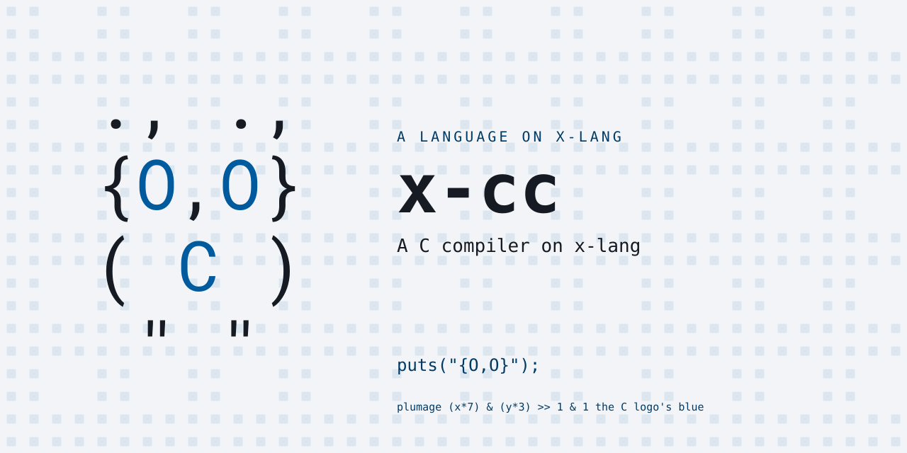
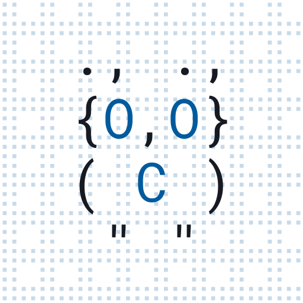

# x-cc

A C compiler on x-lang -- the self-hosting arc's final tier, slice
one: the full front end (preprocessor subset, lexer, recursive-descent
parser with all fifteen expression levels) and an evaluator with a
real memory model, so

    x -l cc -- run prog.c

EXECUTES C, oracle-checked: every spec expectation comes from the same
source compiled with /usr/bin/cc and run.  fib recurses, pointers
write through, arrays decay into functions, bubble sort sorts, and the
output matches the real binary byte for byte.

THE CELL MODEL: memory is one vector of cells; every scalar is one
cell, sizeof any scalar is 1, pointer arithmetic counts cells.
Addresses are real (0 is NULL and guarded), locals live in memory so
&local works, the stack grows down and the heap up.  Programs that
scale by sizeof -- the malloc idiom -- run unchanged; byte-accurate
sizes are the recorded pending.

Working: int/char/void/pointer/array declarations (specifier soup
accepted, erased); all C89 operators with C precedence, short-circuit
&& || and the ternary; truncating division; if/else, while, do, for,
break, continue, return; functions with recursion and prototypes;
globals; string literals (interned); character constants; `#include`
(dropped -- the runtime provides putchar, puts, printf %d %c %s %x,
malloc, free, exit), object-like `#define` spliced token-wise; // and
/* */ comments.

Structs, too: `struct S { ... };`, `typedef struct { ... } T;`,
fields by `.` and `->`, nested structs, arrays of structs, pointers to
structs stepping by the struct's size, struct assignment as a cell
copy, `sizeof` a struct as its cell count, and the linked list built
from `malloc(sizeof(struct N))` -- oracle-checked.  A field access
whose chain the evaluator cannot type (a call's result) resolves by
the field's name when exactly one struct has it.

`switch` runs its matched clause and every clause after it as one
block -- fallthrough -- until a `break`; `return` and `continue` pass
through to the function or the enclosing loop.  Function-like macros
collect their arguments as text across balanced parentheses,
substitute at identifier boundaries, and rescan with the macro open;
no parentheses are added, as in C.

`#ifdef`/`#ifndef`/`#elif`/`#else`/`#endif`/`#undef` and the `#if`
forms a build header needs (`0`, `1`, `defined`) select lines; an
inactive region still tracks its nesting.  Initializer lists lay
values into cells by kind -- `int a[] = {…}` sized by the list,
`struct P p = {…}`, nested lists for arrays of structs, missing
trailing items zero, `char s[] = "…"` from the string's bytes.

Enums fold at parse time (`enum { A, B = 1 << 3, C }` -- constant
expressions, counting on from the last; the type is a scalar; `case
RED:` labels).  A union is a struct whose fields all sit at offset 0,
sized by its widest -- overlap, copy, nesting anonymously in a struct.
Function pointers: `int (*f)(int, int)` as a local, global, parameter,
struct field or typedef, arrays of them with initializer lists; a
function's name is its value (an id above every cell address, never
NULL), and `f(x)`, `(*f)(x)`, `ops[i](x)`, `p->fn(x)` all dispatch as
the named call would -- a native twin called through a pointer from
interpreted code stays native.

Refused loudly, each a recorded pending: structs passed or returned by
value, goto, floats, casts to function-pointer types, `#` and `##` in
macros, byte-accurate sizeof.

`build` lowers the ELIGIBLE functions through the engine's compile-asm
lane to NATIVE machine code, no external toolchain; the rest stay
interpreted (sha256.x's adoption pattern: refuse, fall back).  Two body
shapes lower: `if`/`return` recursion (fib), and **loops** -- a
`{ decls; while|for; return }` function transforms into tail self-
recursion, parameters and accumulators alike riding the self-call with
their folded new values (accumulators' literal inits by arg-padding).
The body fold takes assignments to any of them (a mutated parameter
included -- `gcd` compiles to recursive gcd), body-local temps
(substitution-only), `if`/`else` (each written variable merges as a
ternary), early exits -- `return`/`break`/`continue` inside the loop
as guarded exits, plus loop-invariant pre-loop guards, so search loops
and `isprime` go native -- inits over the parameters (a non-literal
init pads as its own tiny lane function, applied at the call boundary)
-- nested loops, two deep, as a state machine over the one self-call
(each re-entry runs a step of whichever loop is active; an inner
`break` is the transition to the outer step) -- and POINTERS.  The
program's memory is one raw buffer that the interpreter and the native
twins address alike (the lane's `%mem-ref-at`/`%mem-set-at!` with the
buffer's data address baked in), so a pointer is a cell index on both
sides and arrays cross the boundary for free: **a native bubble sort
sorts main's array**.  In a loop body, memory reads become load temps
at their evaluation point and stores become effects, emitted in
program order before the tail.  `x -l cc -- build prog.c` reports each
function's verdict and runs, same output as `run`: fib(24) 67s ->
10.5s wall, a 2,000,000-iteration loop 79s -> 9.5s (the loop itself at
machine speed under the boot).  Stores mixed with early exits, reads
under a short circuit, two sequential top-level loops, three-deep
loops, more than four threaded variables (the lane's arg limit),
globals and cross-calls stay interpreted -- the recorded pendings.

Paired with x-lang v0.10.0 (`lang.xon` is the checkable row).

## Tests

    make test           # the suite, loud on any failure
    make check          # judged against tests/contract/known-failures.txt

## Layout

    lang.xon          what this bundle IS (self-contained)
    run.x             the entry: operands mean "be cc"
    cc/pp.x           comments out, #include dropped, #define collected
    cc/lex.x          C tokens, macros spliced token-wise
    cc/parse.x        the fifteen-level ladder, declarations, statements
    cc/eval.x         the cell machine: memory, frames, calls, builtins
    cc/build.x        the eligible-class lowerer onto compile-asm
    cc/cli.x          run FILE.c | build FILE.c
    tests/            markdown specs + the platform's runner, vendored nowhere

