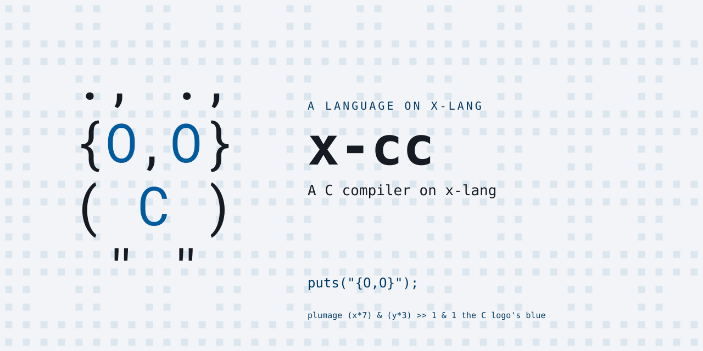
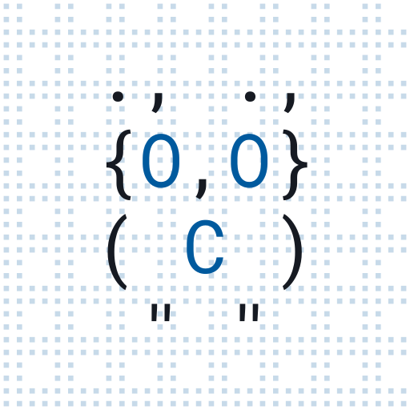

# x-cc

A C compiler on x-lang: a front end (preprocessor subset, lexer,
recursive-descent parser with all fifteen expression levels), a code
generator on the platform assembler, and Mach-O and ELF writers, so

    x -l cc -- build prog.c -o prog

writes an executable that the operating system runs directly: an arm64
Mach-O on macOS, an x86-64 ELF on Linux, for the platform the compiler
runs on.  No external assembler, linker or `codesign` is involved: the
instructions are encoded by x/tool/asm, the container is laid out, and
the Mach-O's ad-hoc code signature is hashed in x.

Both are dynamic executables that the system's C library is loaded into:
the Mach-O names dyld and libSystem, and the ELF names ld-linux and
libc.so.6.  The code generator
evaluates expressions on a stack machine, and keeps every value in a
whole register in its C type's form -- an `int` sign-extended from bit
31, an `unsigned int` zero-extended, a `long` or an `unsigned long` as
all 64 bits -- so arithmetic wraps as C's does in each C type.

Compiled so far: main and the functions beside it, with integer
globals, locals (a static one kept once, in the data) and parameters of
every width, signed and unsigned,
pointers, arrays, pointers to arrays, structs and unions, typedefs of
any of them, assignment, `++` and `--`,
`if`/`else`, `while`, `do`, `for`, `switch`, `break`, `continue`,
`goto`, `return` and calls, recursion included, over integer constants and
string literals, `+ - * / %`, `& | ^ << >>`, the six comparisons,
`&&`, `||`, the ternary, the comma, unary `- ~ ! & *`, casts,
subscripts, and `.` and `->`.  A pointer to a function leads to a thunk
that takes the function's address and branches to a gate the compiler
writes out after the code, and a call through one hands over up to three
arguments, none of them a struct.  The gate keeps the caller's
registers, takes up the program's own -- the data and the trampoline
from where the gate stands, the frame stack's top from where the last
call out left it -- and calls the function, so the C library can call
the program back: a comparator handed to `qsort` or `bsearch`.
A call to a function the program does not define goes to the C
library, which the compiler asks, in its own process, whether it has
the function, refusing the call by name when it does not.  Each such
function is an import: a slot in the data that the loader fills with
the function's address -- through chained fixups in the Mach-O, and a
relocation against a symbol of libc.so.6 in the ELF.  The entry writes
out a trampoline that takes the address and six arguments from the
calling frame, loads the arguments where the C calling convention takes
them, gives the stack the alignment the convention asks for, and makes
the call.  A variadic function is called through its v- form --
`printf` through `vprintf` -- with the arguments past its fixed ones
laid out as a va_list: a pointer to eight-byte slots on arm64 macOS,
and on x86-64 Linux a record whose offsets say the registers are used
up.  The answer is put in the form of the C type the function's header
declares.  main's answer goes to the library's `exit`, which writes out
what the library's streams hold.

main takes argc and argv as the kernel hands them to the entry: dyld
calls a Mach-O's entry with both in place, and the ELF's entry loads
them from the stack the kernel starts it on.

A pointer is an eight-byte address: `&` takes one, `*` loads or stores
through one at the width of what it points at, and `+` and `-` move one
by whole elements.  An array is its elements end to end, and where it is
used as a value it stands for its first element's address, so `a[i]` is
`*(a + i)`.  A struct is its fields at the offsets the parser lays out,
and a union one whose fields all sit at 0; `s.f` and `p->f` are the
struct's address plus the field's offset, assigning a struct copies its
bytes, and a braced initializer fills its fields and zeroes the rest.

The executable has a data segment, mapped readable and writable on the
page after the code -- `__DATA` in the Mach-O, a second `PT_LOAD` in the
ELF.  The import slots are at the front of it, `exit`'s first; the
globals follow, each at its C type's size with the initializer's value
already in place; then the string literals, end to end and each stored
once.  The entry hands compiled code the data's address the way it
hands over the trampoline's.  The executable is loaded where the kernel
chooses and nothing relocates the program's own data, so a global
pointer that starts at an address -- a string literal, an array, what
`&` takes of a global or of a static local in scope, any of these moved
by a constant -- starts as zeros, and main writes the address before
its body runs.

The calling convention is the compiler's own, since nothing else links
with what it writes: the first four arguments in registers, unless
they are structs, and the rest stored where the callee's frame will
have its top, the answer in one register, and a frame per call taken
from a four-megabyte region below the machine stack, a megabyte at most
each.  A frame keeps its scalars low, where a load reaches them, and its
arrays and structs above, reached through their address.  A struct
goes by value: an argument is copied whole to the callee's frame, and a
call that answers one has a slot of its own in the caller's frame,
which the callee's return copies into.  A local, a parameter and a global take
the size and alignment of their C type, and a value loads at that width,
extended by its sign.  An operator works in the C type C's usual
conversions give its operands -- `int` for `char` and `short`, then
`unsigned int`, `long` and `unsigned long` -- and a store converts the
value to its place's C type.  An integer constant has the C type its
suffixes and its value give it.  A `double` is held as its IEEE bits
where a long would be, and works in the machine's d registers; it meets
the integer C types as C's conversions say, and the maths functions --
`sqrt`, `pow`, `fmod` and the rest -- are the C library's, called with
their arguments in the d registers.  Anything else refuses by name:
`float` and `long double`, a call into the C library with more than six
arguments, and a global initialized by something other than a constant
or an address.

    x -l cc -- run prog.c

runs the same front end through an evaluator with a real memory model
instead, and is the reference the compiler is checked against: every
spec expectation comes from the same source compiled with /usr/bin/cc
and run.  Under `run`, fib recurses, pointers write through, arrays
decay into functions, bubble sort sorts, and the output matches the
real binary byte for byte.

MEMORY IS BYTES, at real addresses: the globals, string literals and
stack are in one buffer, anything else is wherever the C library put
it, and every read and write takes the width of its C type -- `char` 1,
`short` 2, `int` 4, `long` and pointers 8, with signed C types
sign-extending.  Width here is a byte count; C11 (6.2.6.2) counts a type's
width in bits.  An address below 4096 is a null pointer and refuses.
`sizeof`, a field's offset and a struct's padding are what /usr/bin/cc
counts.  Arithmetic is C's: an operand narrower than an int promotes
to one, a binary operator's operands meet in the C type the usual
conversions give them, and the result wraps in it.  Locals live in
memory so &local works, and the stack grows down.

THE C LIBRARY IS THE SYSTEM'S: a call to a function the program does
not define goes to libc, opened in the process and searched by name,
with the arguments as the C calling convention passes them -- seven at
most.  A variadic function goes through its v- form (`printf` through
`vprintf`), the arguments after its fixed ones laid out as a va_list.
The answer is converted to the C type the function's header declares,
and `stdin`, `stdout` and `stderr` are the library's own variables.
What the library holds for its streams is flushed when the program
ends, and `exit` flushes before it leaves.  A pointer to one of the
program's own functions cannot be handed to the library, and refuses.

Working: int/char/void/pointer/array declarations (specifier soup
accepted, erased, but for `static` on a local); all C89 operators with
C precedence, short-circuit && || and the ternary; casts, each
converting its operand to its C type and giving the expression that C type;
truncating division; if/else, while, do, for, break, continue, return;
functions with recursion and prototypes; globals; static locals, made
once on first reach; string literals (interned, and joined when side by
side); character constants; C's escapes, octal and hex among them;
`#include` (dropped -- the C library provides the functions -- and one
of a standard header defines `EOF`, `NULL`, `EXIT_SUCCESS` and
`EXIT_FAILURE`), object-like `#define` spliced token-wise; // and /* */
comments.  `x -l cc -- run prog.c ARG ...` hands main the file's name
and the ARGs as its argv, and fd 0 as its standard input.

Structs, too: `struct S { ... };`, `typedef struct { ... } T;`,
fields by `.` and `->`, nested structs, arrays of structs, pointers to
structs stepping by the struct's size, struct assignment as a byte
copy, `sizeof` a struct with its padding, bit-fields of the integer
types but long, and the linked list built
from `malloc(sizeof(struct N))` -- oracle-checked.  A field access
whose chain the evaluator cannot give a C type (a call's result) resolves by
the field's name when exactly one struct has it.

`switch` runs its matched clause and every clause after it as one
block -- fallthrough -- until a `break`; `return` and `continue` pass
through to the function or the enclosing loop.  Function-like macros
collect their arguments as text across balanced parentheses,
substitute at identifier boundaries, and rescan with the macro open;
no parentheses are added, as in C.

`#ifdef`/`#ifndef`/`#elif`/`#else`/`#endif`/`#undef` and the `#if`
forms a build header needs (`0`, `1`, `defined`) select lines; an
inactive region still tracks its nesting.  Initializer lists lay
values into memory by C type -- `int a[] = {…}` sized by the list,
`struct P p = {…}`, nested lists for arrays of structs, missing
trailing items zero, `char s[] = "…"` from the string's bytes.

Enums fold at parse time (`enum { A, B = 1 << 3, C }` -- constant
expressions, counting on from the last; the C type is a scalar; `case
RED:` labels).  A scalar here is a C type the specifiers name on their own
(`int`, `unsigned char`, `double`, `void`); C11's scalar types (6.2.5) are the
arithmetic and pointer types, so the two sets differ.  A union is a struct
whose fields all sit at offset 0, sized by its widest -- overlap, copy,
nesting anonymously in a struct.
Function pointers: `int (*f)(int, int)` as a local, global, parameter,
struct field or typedef, arrays of them with initializer lists; a
function's name is its value (an id above every memory address, never
NULL), and `f(x)`, `(*f)(x)`, `ops[i](x)`, `p->fn(x)` all dispatch as
the named call would.

Structs go by value too: a struct parameter takes its size in the
callee's frame and copies from the argument; a struct returned by
value moves out of the popped frame into a fresh slot in the caller's
(alive until the caller returns), so `make(1, 2).x` and `add(make(1,
2), make(3, 4))` are safe.  In a macro body `#PARAM` is the argument's
text as a string literal and `A ## B` pastes, the rescan lexing the
joined token.

Doubles run as they compile: a double is its IEEE bits, and each
operation on it is the machine's, through the platform's stubs
(x/num/float).

Refused loudly, each a recorded pending: `float`, `long double`, casts
to function-pointer C types.

Paired with x-lang v0.17.0 (`lang.xon` is the checkable row).

## Tests

    make test           # the suite, loud on any failure
    make check          # judged against tests/contract/known-failures.txt

## Layout

    lang.xon          what this bundle IS (self-contained)
    run.x             the entry: operands mean "be cc"
    cc/pp.x           comments out, #include dropped, #define collected
    cc/lex.x          C tokens, macros spliced token-wise
    cc/parse.x        the fifteen-level ladder, declarations, statements
    cc/eval.x         the machine: memory, frames, calls, builtins
    cc/gen.x          code generation, through x/tool/asm
    cc/image.x        the byte image an executable is built in
    cc/macho.x        the macOS executable and its ad-hoc signature
    cc/elf.x          the Linux executable
    cc/cli.x          run FILE.c | build FILE.c [-o OUT]
    tests/            markdown specs + the platform's runner, vendored nowhere

